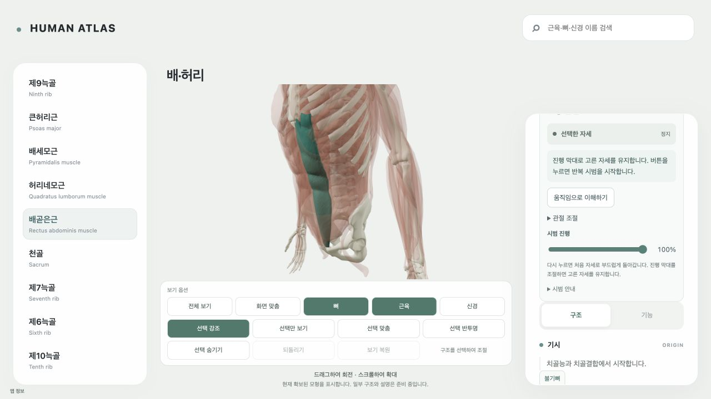
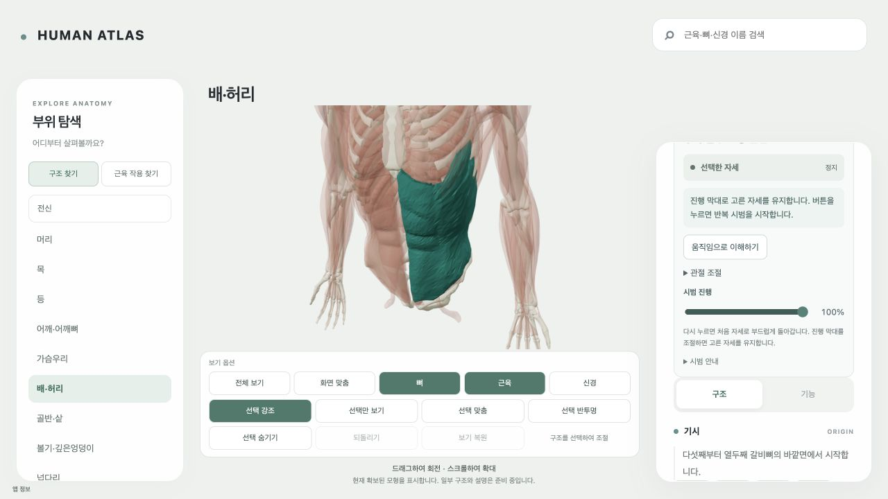

# T66 step04 — 우선 배 근육의 실제 대표 작용

이번 내부 단계는 복직근·외복사근 양측의 **몸통 굽힘**을 기존 단일 scene에 구현·검증했다. 4개의 정확한 source/side/action 선택 경로가 **하나의 실제 GLB**를 공유한다. 근육별 선택 강조와 원본 표면의 변형은 다르지만, 서로 다른 몸통 동작 4개를 만들었다는 뜻은 아니다. 단일 CTA 반복 왕복·재클릭 smooth rest와 scrub 유지 정책을 그대로 사용한다.

외복사근은 양측 협응 굽힘을 대표 작용으로 채택했다. 반대쪽 몸통 회전의 문헌상 의미·좌우 조건은 내부 원장과 설명에 유지했다. 제작한 좌/우 회전 후보는 실제 기하/contact 검사에서 실패하여 **blocked_engineering / unregistered**로 남긴다. 라벨 변경으로 수동 자세나 실패 후보를 작용 합격으로 승격하지 않았다. 회전 기능이 완료되었다고 주장하지 않는다. 사용자의 ‘대표 작용’ 범위를 굽힘으로 구현한 결정은 representative-action-decision.json에 명시했다.

## 실제 구현과 품질

원본 좌우 복직근·외복사근에 source-local weights와 key별 corrective를 작성했다. L5와 골반 지지를 유지하고 L4–L1의 분절별 교육용 굽힘이 흉곽·주변 온전한 뼈/근육·상지를 함께 움직인다. 총 굽힘 14°이며 임상 정상 ROM이나 실측 관절축이 아니다. 고정 구조 5개, 원본 문맥 표면 365개, 실제 변형 표면 33개(수동 횡격막 포함)를 사용한다. 횡격막 변형은 연속된 주변 문맥이며 호흡 작용 제작/합격이 아니다. 정적 신경은 비지원 움직임 자세에서 표시하지 않는다.

실제 emitted GLB의 원본 노드 변환·반사/frame·17 key 및 65 중간 샘플, 토폴로지·새 뼈 containment·부착 문맥·고정 mask·작용 결과를 검사했다. 기존 source overlap은 보존한다. 연속 시간의 모든 충돌이 없다는 증명이나 실측 부착 footprint/생리량 승인은 아니다. Native key replay의 1µm 기준을 유지한다. 공동 rigid 문맥은 독립 glTF TRS 보간 오차를 65 pose에서 명시적 10µm bound로 검사했으며 근육 변형 검사 허용치를 변경하지 않았다.

| 표면 | 측 | authored 단축 | 최대 변위 | 작용 |
|---|---|---:|---:|---|
| 복직근 | left | 29.42mm | 61.17mm | 몸통 굽힘 |
| 외복사근 | left | 27.03mm | 60.34mm | 양측 협응 몸통 굽힘 |
| 복직근 | right | 29.42mm | 61.17mm | 몸통 굽힘 |
| 외복사근 | right | 27.03mm | 60.34mm | 양측 협응 몸통 굽힘 |

## 발견하여 해결한 문제

주변 표면의 접촉 corrective 및 수동 횡격막의 척추 문맥을 실제 실패 지점에서 수정했다. local contact solver의 한 번의 constraint sweep으로 조기 종료할 수 있는 문제를 확인하고 복구 도구와 회귀 2건을 남겼다. 이것이 실패 회전 후보의 합격을 뜻하지는 않는다.

기존 motion 계약은 좌측/우측 주제의 bone context에 반대측 및 midline 뼈를 일괄 거절했다. 실제 검증된 family의 moving/fixed source bone membership에만 예외를 허용했다. 선택 근육의 정확한 identity/좌우 검사는 유지하며 잘못된 role·side·미검증 family는 허용하지 않는다(경계 회귀 4건).

브라우저 로딩과 production build에서 generic 8MiB delivery 제한이 큰 native 몸통 패키지를 거절했다. 불필요한 buffer/accessor를 제거하여 motion 36,508,640→31,306,820 bytes, 정적 reference 29,606,896→6,846,956 bytes로 줄였다. 사용되는 accessor byte·원본 topology/geometry·17 key·365 문맥은 동일하다. 그래도 기존 한도를 넘으므로 **이번 exact URI+SHA에만 실제 31,306,820 bytes 한도**를 적용했고 다른 파일은 8MiB 그대로다. hash 검증·경계 경로 검증을 유지했다. 예외의 URI나 SHA가 달라지면 기본 한도로 돌아간다. 자동 lazy load와 공유 URI를 유지하며 초기 앱 bundle에 GLB를 넣지 않는다.

브라우저 DOM 진단에서 motion CPU geometry estimate 61,882,524 bytes, 신경 layer 포함 관측된 combined estimate 99,242,180 bytes였다. 기존 loader budget 100,663,296 bytes를 바꾸지 않았다. GPU/VRAM/total-process memory는 관측하지 않았고 cold/warm loading 또는 frame benchmark를 새로 수행했다고 주장하지 않는다. build 앱 JS 6,712.89kB/gzip739.55kB의 기존 유형 chunk 권고 경고가 남는다.

## 실제 검증

- 관련 회귀 35/35, source-context 4/4, contact projection 2/2, bounded delivery 1/1 및 motion schema fixtures 통과.
- production build/typecheck/full motion contract·policy 및 learner distribution audit 통과.
- desktop 실측 **1280×720 CSS viewport**, canvas/scene 1개: 양측 각 4source의 loop·reclick 완료 rest·scrub50/100%, source 선택/좌우, 숨김/layer-off guard, 카메라 키보드, 뒤/앞을 실제 확인했다.
- 정적 native nerve 46표면은 layer-on rest에서 보이고 nonrest에서 0, rest에서 같은 집합이 복원됨을 DOM scene 진단과 실제 PNG로 확인했다. 사용자 layer 상태와 같은 scene root를 유지했다.
- 콘솔 오류/경고0. 390/1024/1440 및 모바일 실기기 검증은 이번 단계에서 주장하지 않는다. 공유 reduced-motion/frame clock은 관련 회귀로 확인했으며 OS 설정 직접 변경은 하지 않았다.
- 실제 dependency 1,124개 hash 대조(4authoring record 반복 참조 포함), preexisting common rows/상태 보존 확인. 같은 입력의 이전 QC는 영향/byte동일성 근거로 재사용했다.

## 판정 및 남은 범위

이 내부 단계: completed/passed, acceptanceScope는 **양측 native 복직근 굽힘 + 외복사근 양측 협응 굽힘**. productReadiness=local_supported_priority_trunk_actions_ready, contentCompleteness=partial, unresolvedProductBlockers=[]. 4source surface/4source-action binding/1unique motion GLB이며 정적 reference는 움직임 asset 수에 중복하지 않는다. scope revision은 representative-action-decision.json과 T66 priorityTrunkUnit에 명시했다.

누적 우선군 기준: 7/7근육군에 대표 작용, 20고유 표면, 22exact binding, 13unique GLB. 전체 해부학·모든 작용/ROM 완성이 아니다. historical 전체 atlas snapshots는 이 단위의 집계로 재분류하지 않는다.

부모 **T66은 in_progress / partial**, nextUnit=author-and-integrate-normal-motion-bone-and-nerve 유지. 최종 통합·supported app/nerve/cross-viewport 판정이 남는다. 외복사근 unilateral rotation 후보와 기존 범위 밖 턱/얼굴/호흡/E-index 수리는 별도 deferred engineering이며 원본 source 부재로 재분류하지 않는다. 기존 542/563/12, muscle429/447/232concepts/462surfaces, HA130, 역사163(6/20/135/2), source-only·rights held·humanReview not_performed를 유지했다. 원본/source-cache/OpenSim/T13를 변경하지 않았다.

다음 수동 파일: work/plans/t66-priority-atlas-2026-10-05/05-integration-close.txt. 실행하지 않았다. 로컬 커밋은 현재 workspace의 소유 checkpoint이며 선행 WIP를 포함한 clean-HEAD 단독 앱 완성은 주장하지 않는다. 복사된 baseline/중복 GLB·미등록 회전 binary/작업 cache는 스테이징에서 제외하되 로컬 보존한다.
