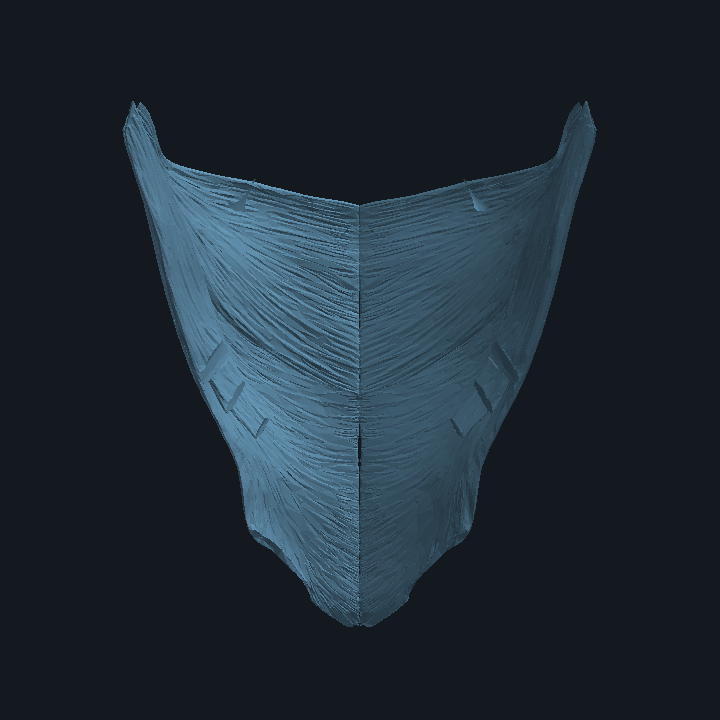
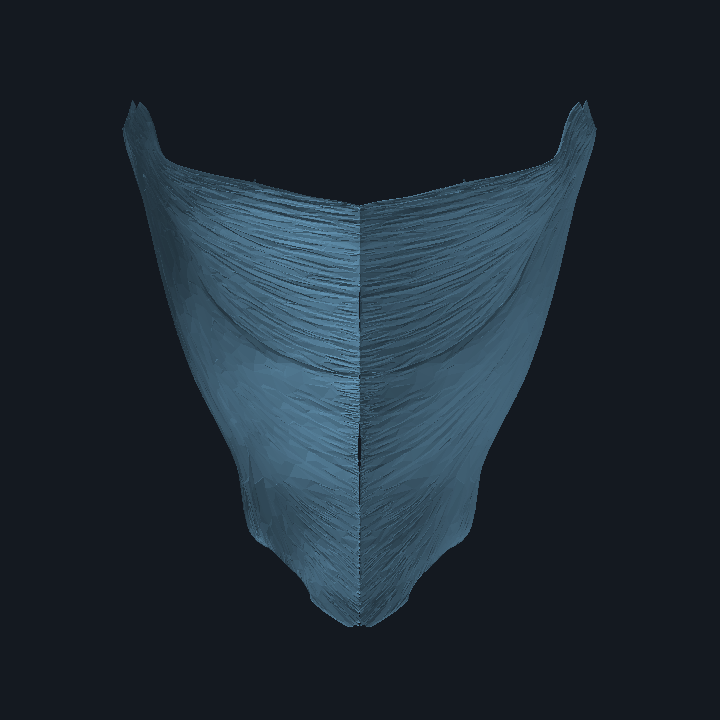
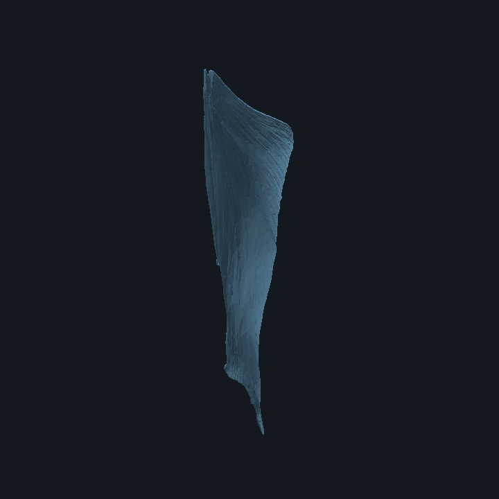

# T97 — 광배근 공식 aggregate 실제 객체 확인

**상태: `passed_with_gaps`** · 2026-09-28 · Luna Max

## 판정

정확히 고정한 Z-Anatomy commit의 단일 `Z-Anatomy.zip`을 실제 취득해 격리 검사를 통과시켰다. `Startup.blend`의 archive-wide datablock 이름을 전수 색인하고 내부 Object/Collection/Mesh 관계를 읽어, 광배근 명칭을 가진 6개 Object와 3개 공유 Mesh data-block을 찾았다. 양측 주 근육 표면 2개와 별도 소형 표면 4개를 원본 좌표와 저장된 Object 행렬 그대로 QA OBJ로 추출했고 실제 삼각형 표면의 정면·후면·측면 preview를 생성했다.

이는 **후속 exact-object 검토를 가능하게 한 source candidate 확인**이다. 오브젝트 명칭만으로 `TA2:2231`과의 canonical identity를 확정하지 않았고, learner binding·scene 통합·권리 승인·해부학 검토·frame 적합 판정을 하지 않았다. 따라서 T93/T94의 기록상 `no_exact_source_found` 결과를 수정하거나 덮어쓰지 않는다. T97 이후 새로 열어 확인한 archive candidate가 있다는 점만 추가한다.

## 고정 source 및 격리 검사

공식 [Z-Anatomy / Models-of-human-anatomy pinned commit](https://github.com/Z-Anatomy/Models-of-human-anatomy/tree/c7010a903b75a2fd24a13b1c2c4c3546a9223780)에서 root의 ZIP 후보 하나만 받았다.

| 항목 | 기록 |
|---|---|
| repository / commit | `Z-Anatomy/Models-of-human-anatomy` / `c7010a903b75a2fd24a13b1c2c4c3546a9223780` |
| 요청 URL | `https://github.com/Z-Anatomy/Models-of-human-anatomy/raw/c7010a903b75a2fd24a13b1c2c4c3546a9223780/Z-Anatomy.zip` |
| 최종 URL / 응답 | `https://raw.githubusercontent.com/Z-Anatomy/Models-of-human-anatomy/c7010a903b75a2fd24a13b1c2c4c3546a9223780/Z-Anatomy.zip` / HTTP 200 (redirect 302 1회) |
| 수신 크기 / SHA-256 | 86,734,957 bytes / `e029688545627bd0214b269e1063143abb580aad72b2c2445d6d8a9a0d9da736` |
| 안전 상한 | 전송 120,000,000 bytes, 해제 1,000,000,000 bytes, 10,000 files |
| preflight / 해제 | 7 archive entries (6 files + 1 directory), 예상·실제 해제 308,000,884 bytes, symlink 0, 모든 CRC와 파일 SHA 검증 |
| 원본 보관 | `atlas-data/source-cache/z-anatomy/t97/` 아래 ignored cache; tracked 산출물에 archive bytes를 복사하지 않음 |

archive 내부 경로와 CRC/SHA는 [archive-member-inventory.json](../evidence/T97/archive-member-inventory.json)에 기록했다. 여섯 파일은 `Anatomy-shortcuts.py`, `Anatomy_Bright.xml`, `Anatomy_Dark.xml`, `splash.png`, `Startup.blend`, `__init__.py`다. 특히 `Startup.blend`는 306,838,281 bytes이며 SHA-256 `9f08a17ea0115fed80b2a73ecdf0a1bc2ab2f6956f37c593ce23d513ea35afcd`다. ZIP에는 별도 `License.txt`가 없다. addon source에 GPL notice가 있는 사실을 기록했지만 이를 개별 mesh 사용·재배포 허가로 해석하지 않았다.

압축 해제기는 path traversal, absolute path, symlink, 중복 경로와 상한 초과를 거부한다. 예상/실제 크기가 모두 상한 아래여서 중단 조건에 해당하지 않았다. acquisition receipt와 추출 manifest는 [archive-acquisition.json](../evidence/T97/archive-acquisition.json), [archive-member-inventory.json](../evidence/T97/archive-member-inventory.json)에 있다.

## Archive object inventory 및 후보 경로

`Startup.blend` 원본을 수정하거나 Blender에서 성공적으로 연 적은 없다. read-only BHead/SDNA parser로 archive 전체 내부 이름 인덱스를 만들었다. header는 `BLENDER-v305` (8-byte pointer, little-endian)이며 데이터 수는 Object 7,184, Mesh 2,910, Collection 1,945, Scene 1이다. archive-wide 모든 datablock 이름은 [blender-object-inventory.json](../evidence/T97/blender-object-inventory.json)에 있고, exact candidate Object ID locator·부모·Mesh datablock·rooted Collection 경로는 그 파일과 [latissimus-extraction.json](../evidence/T97/latissimus-extraction.json)에 있다.

| Object 이름 / 내부 ID pointer | 부모 Object | Mesh data-block (pointer) | source Collection path |
|---|---|---|---|
| `Latissimus dorsi muscle.l` / `0x18b63c61d08` | `Hypaxial muscles of back.g` | `Latissimus dorsi muscle` / `0x18b67bf4f08` | `Scene Collection / 4: Muscular system`; `Bonus collection / Muscular system / Superficial muscles`; `… / Muscles`; `… / Dorsal part of muscular system / Hypaxial muscles of back`; `Bonus collection / Regions of human body / Main divisions / Trunk`; `… / Trunk / Back` |
| `Latissimus dorsi muscle.r` / `0x18b63c60808` | `Hypaxial muscles of back.g` | same Mesh data-block / pointer as `.l` | same six rooted paths as `.l` |
| `Latissimus dorsi muscle.el` / `0x18b63c62b08` | `Scapula.l` | `Latissimus dorsi muscle.e` / `0x18b67bf4808` | `Scene Collection / 2: Muscular insertions` |
| `Latissimus dorsi muscle.er` / `0x18b63c62408` | `Scapula.r` | same `.e` Mesh data-block / pointer as `.el` | `Scene Collection / 2: Muscular insertions` |
| `Latissimus dorsi muscle.ol` / `0x18b63c61608` | `Hip bone.l` | `Latissimus dorsi muscle.o` / `0x18b67bf4108` | `Scene Collection / 2: Muscular insertions` |
| `Latissimus dorsi muscle.or` / `0x18b63c60f08` | `Hip bone.r` | same `.o` Mesh data-block / pointer as `.ol` | `Scene Collection / 2: Muscular insertions` |

`Anatomy-shortcuts.py` and `__init__.py` were read as text only; neither was executed. The pinned add-on's `clean_name()` at `__init__.py:343–349` recognizes literal terminal `.l` and `.r` as side suffixes. This supports the primary Object pair's side labels; their same source Mesh datablock and saved object matrices also show opposing X-axis reflection and opposite X translation. The four additional Objects inherit a side clue from their actual parent Object name (`Scapula.l/r`, `Hip bone.l/r`), rather than interpreting their own `.el/.er/.ol/.or` endings.

The main `.l/.r` objects share one 10,796-vertex, 32,370-edge, 64,740-loop, 21,580-polygon Mesh datablock. `.el/.er` share a 150-vertex / 380-edge / 696-loop / 231-polygon datablock. `.ol/.or` share a 58-vertex / 103-edge / 159-loop / 46-polygon datablock. The latter two pairs reside in a Collection named `2: Muscular insertions` and are parented to scapula and hip bone Objects, respectively. Their roles are recorded as separate candidate subobjects; their `.e/.o` naming, polygon geometry and anchor parents do **not** establish a canonical head/part or an origin/insertion interpretation. Candidate custom properties expose only local presentation/tool keys (`SheetGenerator`, `M3`, `MeasureItArchProps`, cross-section toggles, colors/shader keys); no target TA2/FMA/FJ crosswalk was found there.

Object names, Blender internal ID pointers, file block offsets, parent pointer/name, mesh pointer/name, all rooted collection paths, saved transforms, local property names, per-array hashes and combined raw-geometry hashes are recorded in `latissimus-extraction.json`. The extraction preserved three source mesh datablocks and six source Objects; no new anatomy ID or product mesh was created.

## 실제 표면 preview 및 도구 제한

여섯 QA OBJ는 모두 local Object matrix를 적용한 **출처 mesh의 실제 MVert/MLoop/MPoly 표면 배열**에서 만들었다. OBJ별 bytes/SHA와 counts, 세 원본 mesh data-block의 vertex/loop/polygon array SHA 및 결합 geometry SHA는 [latissimus-extraction.json](../evidence/T97/latissimus-extraction.json)에 있다. QA OBJ는 ignored cache에만 있다.

실제 표면을 출처 좌표계의 Y−, Y+, X+ 세 방향에서 rasterize했다. archive의 X/Y축 해부학 방향은 T97에서 확인하지 않았으므로 preview를 전면/후면 방향으로 해석하지 않는다. 렌더에는 43,762개 triangulated face 입력과 z-buffer가 사용됐다. 이는 별도 표면 확인용이며 Blender scene, material, pose, modifier 결과가 아니다.







파일 SHA-256과 재현 가능한 orthographic camera·target·scale·triangle/depth-write 수는 [surface-preview.json](../evidence/T97/surface-preview.json)에 있다. 독립 검토 시 동일 실행 명령은 `python3 work/evidence/T97/render_surface_preview_stdlib.py`다.

Blender 3.5.0, 3.5.1, 5.2.2를 공식 checksum으로 확인하고 `--disable-autoexec` 상태에서 검사했지만 세 실행이 139로 종료됐다. 5.2.2 clean factory-scene preview 실행도 Python output 전에 종료됐고 crash log는 Metal GPU backend capability 탐지 중 `wm_homefile_read` 초기화 경로를 보여준다. 따라서 Blender가 원본 파일을 정상 로드했다고 주장하지 않는다. [blender-load-attempts.json](../evidence/T97/blender-load-attempts.json)과 원본에서 분리된 표면 raster preview를 구분해 보관했다.

## 독립 검증 및 보존

- 재현: archive preflight/CRC/hash, 전체 internal datablock name index, six-object subset, exact paths/parents, mesh-data sharing, raw array geometry SHA, six transformed QA OBJ hash/count, 세 PNG hash/dimensions/z-buffer writes를 `python3 work/evidence/T97/validate_t97.py`에서 검증한다.
- `parse_blend_datablocks.py`는 `.blend` embedded code를 실행하지 않는 read-only BHead/SDNA inventory 도구다. `extract_latissimus_objects.py`도 원본을 열지 않고 세 target mesh array와 saved object matrix만 추출한다.
- T93/T94의 `no_exact_source_found` decision/report 파일은 시작 SHA 그대로이며, 두 과거 판정·report/evidence를 수정하지 않았다. T97은 실제 archive object name/path와 표면을 새로 확인했지만 `TA2:2231`와의 independent identifier/crosswalk를 확립하지 않았다.
- archive 자체에 Blender autoexec가 비활성화된 것을 넘어, source `__init__.py`/`Anatomy-shortcuts.py`, drivers, modifiers, animation을 실행하지 않았다. 실제 mesh 이름 일치만으로 anatomy identity를 승인하지 않았다.
- `OpenSim_Models`는 시작 HEAD `d9b05d470b1a481c222372c85b75772faf8f7792`에서 clean으로 보존했다. 시작 HEAD `138e34e63f23a29b4cef34605dcaff2501a40015`, staged file 없음, 기존 사용자 WIP 70개와 기준 status SHA `1d685761e8ba141c26bca22755b0054c186f6ef4d26fbdd7d453e4af8b8260ad`를 [start-baseline.json](../evidence/T97/start-baseline.json)에 기록했다. 남은 pre-existing WIP path 확인은 [preservation.json](../evidence/T97/preservation.json)에 있다.
- 확인된 원본 명칭·parent·Collection만 보존했다. side evidence는 source `.l/.r` suffix convention과 parent side label이며, `.e/.o` 의미, source-to-TA2 identity, upstream component ancestry, source unit/frame/rest pose, T50 호환성은 미확인이다.
- rights는 `held`, human anatomy review는 `not_performed`, canonical binding·learner visibility·scene registration은 0/미수행이다. geometry-null/context manifest, OpenSim 원본 및 다른 지역 자산은 수정하지 않았다.

검증 세부 결과는 [validation.json](../evidence/T97/validation.json)에 기록한다. T97은 실제 bilateral candidate object/surface 확인을 끝내 `passed_with_gaps`로 마감한다. 미완인 canonical identity, `.e/.o` 역할, rights 및 frame 적합성은 T98/T99의 별도 범위에서 증거를 확보하기 전 승격할 수 없다.

## T97 이후

R15 registry의 T97 explicit `defaultNext`는 **T101 / Luna Max**다. T101의 정확한 범위는 `work/tasks/T101.md`다. T97은 T101을 시작하지 않는다. T98/T99의 광배근 등록·정합 및 권리/pose gate 역시 각각의 명세와 실제 의존 queue에서 결정한다.

```text
HUMAN ATLAS에서 T101만 수행해라. 담당 Luna Max.
AGENTS.md, 최신 work/STATUS.md와 work/task-registry-r15.json, 설계 13/14/15/16 및 19/20/21, work/evidence/2026-09-28-efficient-plan/execution-queue.json, work/tasks/T101.md와 선행 실제 report/evidence/manifest를 읽고 최신 동적 queue를 확인해라. 시작 HEAD/status와 실제 입력 hash를 기록하고 기존 사용자 WIP, OpenSim_Models, 원본/역사 freeze 및 T13 drafts를 보존해라.

동결한 T96 target 및 명세에 적힌 BodyParts3D R4 source IDs만 T79에서 검증된 선택 취득·변환 도구로 다룬다. FJ1393, FJ1393M, FJ1394M, FJ1395, FJ1395M, FJ1396, FJ1396M, FJ1397M, FJ1398, FJ1398M의 각 원문 OBJ header/hash/좌우/부분/단위/frame/bounds 및 T50/T69 변환을 개별 검증하고 기존 AnatomySceneRoot/renderer와 same-scene extension만 사용해라. parent whole-muscle surface와 부분 mesh 중첩 여부를 실제 geometry로 확인하고 source 원본은 보존해라. ancestor 이름만으로 ID/binding을 만들거나 권리·human review hold를 승격하지 마라. exact input 또는 권리/frame 근거가 필수 합격을 막으면 같은 T101을 partial로 재개하고 다른 ID로 자동 넘기지 마라.

정확한 subset의 실제 표시·좌우·근접/전신·layer-off·중복node·브라우저 검증과 관련 데이터/typecheck/build를 실행하고 결과·미완·STATUS/R15 status delta를 기록해라. 소유 변경만 선별 커밋하고 staged diff를 확인해 해시·포함/제외·잔여 변경을 보고해라. push·배포·추가 source archive 취득·진단·치료·침 시뮬레이션은 하지 마라.
```
