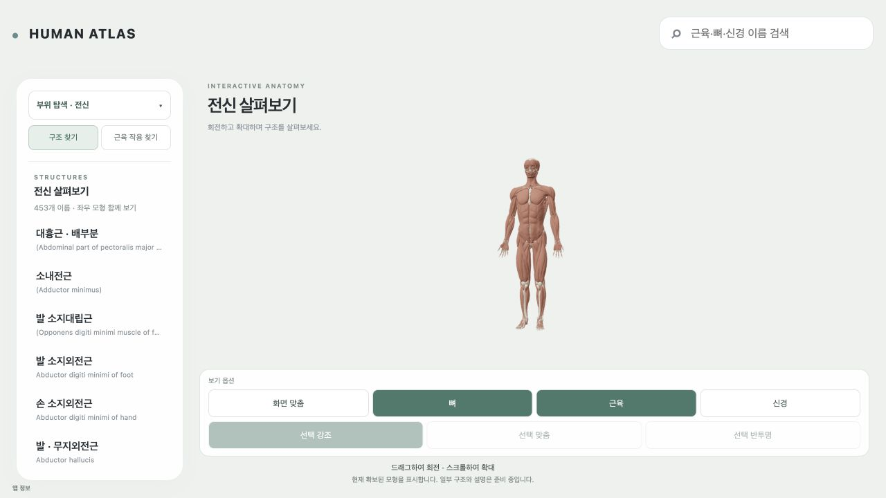
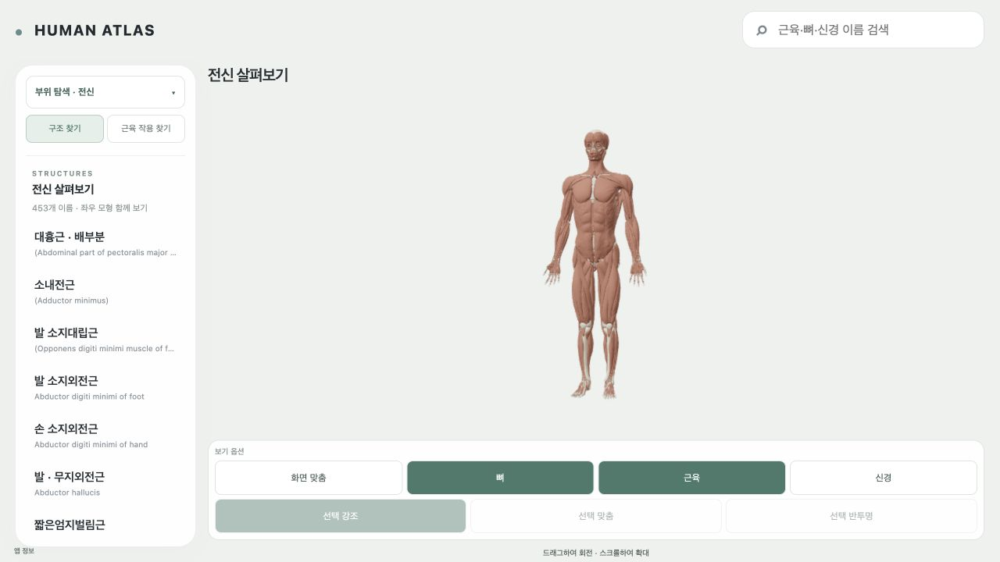
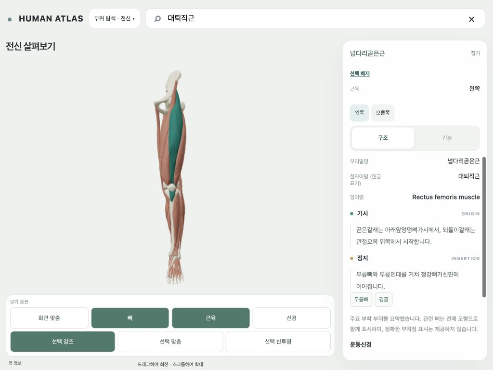
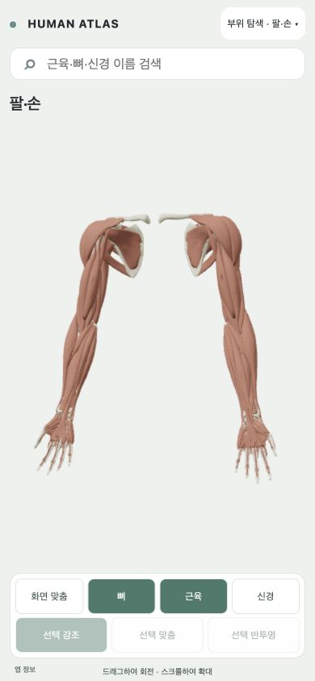

# 모형 영역과 설명 패널 — 01-layout

**이번 UI 단계는 완료했다.** 기존 지원 앱의 레이아웃·설명 읽기·보기 옵션·복수 부위 탐색·resize 흐름에서 제품 blocker는 확인되지 않았다. 콘텐츠 completeness는 기존대로 partial이다. T40/T66/T85, EXECUTION, acceptance 및 다음 task 상태를 바꾸지 않았다.

## 바뀐 동작

- 큰 상단/하단 고정 여백을 줄였다. 데스크톱은 왼쪽 탐색–중앙 모형–오른쪽 설명을 사용한다. CSS 예약 공간과 기존 측정된 toolbar 높이를 공통 경로로 사용하며 강제 zoom을 추가하지 않았다.
- 태블릿은 설명을 옆에서 접거나 펼친다. 휴대폰은 모형 아래의 카드에서 본문만 스크롤한다. 접으면 모형 공간이 늘어난다.
- 제목·좌우 버튼·구조/기능 탭은 본문과 분리해 항상 접근할 수 있다. 구조 기본 선택과 수직 기능 목록을 유지했다. 새 구조는 해당 내용의 시작에서 읽고, 같은 구조의 탭으로 돌아오면 이전 읽기 위치를 복원한다. 스크롤은 React state로 올리지 않는다.
- 보기 옵션은 컨테이너 안에서 wrap하며 44px 버튼과 초점 표시를 사용한다. 부위 메뉴와 결과 목록의 별도 스크롤, 복수 선택 중 메뉴 열림을 유지한다.
- scene/controller/renderer/camera/player 코드는 수정하지 않았다. resize는 기존 projection/renderer size 변경 경로를 사용하며 임의 fit/reset이나 scene 재생성을 추가하지 않았다.

## 실제 화면 비율

단위는 CSS px이며 높이까지 실제 viewport에서 확인했다. 수치는 canvas 직사각형이며 해부학적 지원율이 아니다.

| 화면 | 변경 전 canvas | 변경 후 canvas | 높이 증가 |
|---|---:|---:|---:|
| 홈 1280×720 | 976×317.5 | 994×439.5 | 38.4% |
| 홈 1440×900 | 1136×497.5 | 1154×619.5 | 24.5% |
| 홈 1024×768 | 1024×415.5 | 1000×487.5 | 17.3% |
| 홈 390×844 | 390×491.5 | 390×554 | 12.7% |
| 카드 열림 1440×900 | 802×497.5 | 834×619.5 | 24.5% |
| 카드 열림 1024×768 | 1024×225.4 | 684×487.5 | 116.3% |
| 카드 열림 390×844 | 390×277.1 | 390×300.8 | 8.6% |

1280×720에서는 canvas 화면 점유 면적이 33.6→47.4%로 늘었다. 같은 표본의 색 픽셀 기반 전신 외곽 추정 높이는 249→346px(화면 높이의 34.6→48.1%)이다. 이 추정은 뼈/근육의 기하 bounds 검사가 아니다. 패널/본문/탭의 전후 치수와 모든 계산은 [validation.json](validation.json)에 남겼다. 다른 초기 before PNG는 viewport 전환 중 프레임이어서 모형 크기 비교에 사용하지 않았다. 잘못된 치수의 before 1024 선택 캡처 1장은 검증 근거에서 제외했다.

## 검증

- 실제 390×844, 1024×768, 1440×900에서 전신→머리/목→팔/손→넙다리/종아리 전환과 복수 선택 메뉴 유지. 모형 머리/발 및 대표 지역 bounds가 화면 안에 보이는 것을 PNG에서 확인했다. 초기 1280×720 문제 표본도 재확인했다.
- 대퇴직근의 기존 무릎 폄 loop→재클릭 smooth rest, 0/50/100% scrub, 좌우 선택, 구조 기본 탭, 키보드 탭 전환, 카드 접기/펼치기, layer-off 및 반투명 상태 확인. 새 모션 품질/범위 승인으로 세지 않는다.
- resize 1440→390에서 같은 root와 단일 canvas를 유지했다. held phase는 50% 그대로였고 camera 좌표 차이는 부동소수점 오차 수준(최대 약 4.4e-16)이었다. 근육 layer-off와 선택 반투명도 resize 후 유지했다. 실제 화면 맞춤/부위 선택은 기존 명시적 bounds fit을 사용한다.
- 같은 구조 기능 탭의 읽기 위치 618.5px를 구조→기능 전환 후 618.5px로 복원했다. 새 반대측 선택에서는 구조 탭/본문 시작으로 이동했다. 뒤로 선택 복원도 확인했다.
- 영향받는 관련 정책/탐색/등장 계약 **32/32**, TypeScript, generated card/motion freshness, production/local build, 소유 diff check와 `sync_execution.py --check` 통과. 기존 NEXT WIP의 EOF 공백 경고는 수정하지 않았다.
- 최종 전달 주소의 console error는 0이다. 개발 중 JSX 임시 편집으로 생긴 fetch 오류 2건은 수정·재로딩 후 해결했고 최종 앱 오류로 남지 않는다. 큰 JS chunk 경고는 기존대로 남으며 예산을 상향하지 않았다.

치수/PNG SHA: [validation.json](validation.json). 입력 SHA: [baseline.json](baseline.json). 실제 흐름: [flow-checks.json](after/flow-checks.json), [resize-state.json](after/resize-state.json), [scroll-keyboard.json](after/scroll-keyboard.json), [delivery-check.json](after/delivery-check.json). 자동 출력: [contract-tests.txt](contract-tests.txt), [typecheck.txt](typecheck.txt), [build-local.txt](build-local.txt).

브라우저 캡처 API의 JPEG 화면을 픽셀 변경 없이 PNG로 변환했다. 최종 PNG 27장의 형식/실측 치수/SHA를 검사했다. CSS390은 아이폰 실기기 검증이 아니며 iPad/모바일 Safari·GPU/VRAM 측정은 수행하지 않았다. reduced-motion의 기존 계약과 CSS를 보존했고 새 실기기 OS 설정 검증으로 주장하지 않는다.

## 실제 지원 범위와 보존

지원된 기존 근육/뼈/신경의 선택·카드와 기존 player에 공통 적용하는 UI 개선이다. 새 geometry/부착 footprint/신경 관계/clip/사람 승인을 추가하지 않았다. 기존 전체 콘텐츠 확보, 미지원 작용/신경 pose 및 이전 deferred engineering은 별도 상태 그대로다. 자료 부족이나 미래 자산 제작을 이번 UI gate로 가져오지 않았다.

542 targets/563 memberships/12부위, HA130·역사163, 원본/source-cache/OpenSim_Models/T13/WIP를 보존했다. 전달 스냅샷의 비앱 파일 **94/94는 이전 스냅샷과 URI/bytes/SHA가 동일**하다. source-only, 공개 권리 held, humanReview=not_performed, canonical membership 미승격은 독립 상태 그대로다. controller/viewer/wholeBody.css 및 EXECUTION/product-acceptance 입력 SHA가 그대로여서 기존 asset/action/extent/QC 근거를 재사용했고 레이아웃 영향 UI만 새로 검사했다.

로컬 주소: http://127.0.0.1:5184/ . 새 snapshot은 `local-20261007134505825-bf4218bb`, manifest SHA는 `a5eb7a0fa2058cc2774b9e8ac1928813266925f677365bf76c5799812b995dac`이다. 보존된 작업 트리 기반이며 당시 working-tree 의존 17개를 snapshot에 명시했다. 이 의존 파일들을 이번 커밋에 포함하지 않는다. 99개 공개 경로가 로컬 패키지에 있으며 외부 배포하지 않았다.

## 인계

다음 입력은 `work/plans/atlas-ui-graphics-and-hosting-2026-10-07/02-observation-and-camera.txt`이다. 이 단계의 report/validation과 현행 레이아웃을 이어받아 관찰 시점·깊은 구조 접근만 수행한다. 이번에는 실행하지 않았다.
