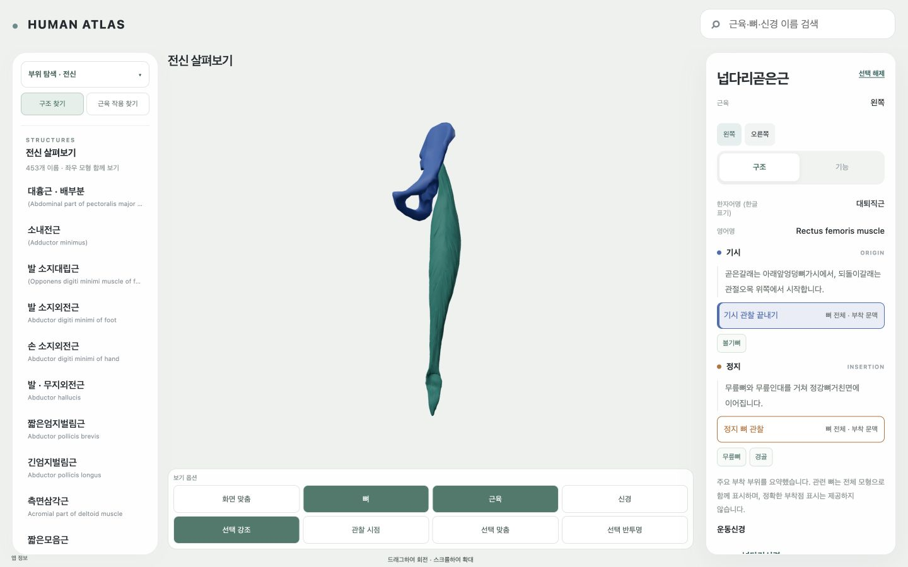

# 04 기시·정지 → 관련 뼈 관찰: passed

현재 지원 근육의 구조 탭에서 **기시 뼈 관찰 / 정지 뼈 관찰**을 선택하면 선택 근육과 해당 뼈를 같은 장면에서 관찰합니다. 기시는 파랑, 정지는 주황이며 텍스트와 눌림 상태를 함께 제공합니다. 이 표시는 뼈 전체의 부착 문맥이고 정확한 footprint가 아닙니다. 관찰 종료·다른 구조·기능 탭·뒤앞 이동은 관찰 상태를 해제하고 기존 카메라 복원 경로를 사용합니다.

## 실제 지원 집계

| 구분 | 항목 | 고유 근육 표면 |
|---|---:|---:|
| 자동 대조 분모 | 924 기시/정지 | 462 |
| 유효 설명 | 920 | 461 |
| 뼈 문맥 연결 | 441 → **523** | **335** |
| 정확한 부착 영역 | **0** | **0** |

뼈 관계 링크는 625 → 731건입니다. 새 82항목은 기존 설명에서 확인한 뼈·부모 뼈 문맥을 현재 source/side/frame/표면과 대조해 연결했습니다. 정확한 영역이나 새 canonical binding을 만들지 않았습니다. 기존 generated card writer의 기본 매칭 의미는 유지하며, 런타임의 명시적 whole-bone 문맥에만 확장 매칭을 적용했습니다. 같은 integration 배열에 source/role별 결과를 캐시하고 material 인스턴스를 공유합니다.

7우선 근육군의 available 양측·part는 20표면/40항목입니다. 38항목은 뼈 문맥이며 대흉근 배부분의 양측 기시는 널힘줄이므로 뼈를 만들어 연결하지 않았습니다. 대/소능형근, 대흉근 세 부분과 좌우를 각각 대조했습니다. 근육 그룹을 단일 부착점으로 합치지 않았습니다.

## 검증과 실제 화면

- 924항목 자동 대조: 뼈 identity·side·namespace·canonical meter frame·finite matrix·실제 표면/resource SHA·적격성·숨김/layer 정책 오류 0.
- 관련 계약 회귀 21/21, typecheck, 최종 local production build, learner 배포 메타데이터 검사, sync_execution.py --check 통과. 기존 chunk 크기 안내는 남아 있습니다.
- 실제 브라우저: 7근육군/20양측·part, 기시/정지/해제, 근육과 뼈 반투명 유지, 숨긴 뼈 재등장 차단, bone layer-off, 선택/뒤앞, 대퇴직근 기존 loop/reclick rest 및 scrub → 구조 관찰 복원을 확인했습니다.
- 최종 전달 빌드에서 실측 1440×900 / 1024×768 / 390×844, canvas 1개·장면 root 유지·수평 overflow 없음·console error 0. 390은 데스크톱 CSS 폭이며 아이폰/아이패드 실기기 검증이 아닙니다. 화면 변경 직후 캡처는 과도 상태로 분리했고 정착 화면 PNG를 남겼습니다.

## 영향과 보존

동일 snapshot 입력의 non-app 파일 94개와 SHA는 모두 동일합니다. geometry/clip/texture 변경 0, 새 shader/texture 0. 앱 전송 bytes는 3,312,251 → 3,317,155 (+4,904)입니다. GPU/VRAM 측정은 수행하지 않았고 새 성능 향상 수치를 주장하지 않습니다. 기존 dirty-render 정책과 source 자산 검증을 영향 분석 후 재사용했습니다.

이 빌드는 현재 보존된 WIP에 의존하는 로컬 snapshot입니다. 입력 해시는 input-baseline.json / attachment-audit.json, 실제 snapshot은 local-20261007233141900-bf4218bb, manifest SHA b78080da3ad8b5cb7903c6ad780f324405c8b6456866c371fe6fa6f1facaba24입니다. 기존 DatasetSceneAdapter midline-bone WIP는 별도 보존하며 커밋에는 이번 presentation 변경만 분리합니다. 원본/source-cache/OpenSim_Models/T13, 전체 분모 542/563/12, HA130·역사163, source-only/local selection/public rights held/humanReview=not_performed와 다른 task 상태는 변경하지 않았습니다.

## 남은 콘텐츠와 종료

설명 미지원 4항목, 유효 설명은 있지만 유일한 뼈 문맥을 결정하지 못한 397항목, 정확한 영역 지원 0입니다. 397항목에는 비뼈 부착도 포함되므로 전부 자료 누락으로 단정하지 않습니다. T13의 41 부착 기록은 spatial geometry null이며 근육 motion masks는 뼈 footprint가 아닙니다. 현재 확보된 영역 연결 누락은 없고 새 점/영역을 생성하지 않았습니다. **현재 단계 제품 blocker 0 / contentCompleteness=partial**입니다. 전체 부착 영역 완성을 주장하지 않습니다.

다음은 `work/plans/atlas-ui-graphics-and-hosting-2026-10-07/05-nerve-and-motion-emphasis.txt`이며 실행하지 않았습니다. T40/T66/T85 record와 다음 task 상태를 변경하지 않았습니다.
