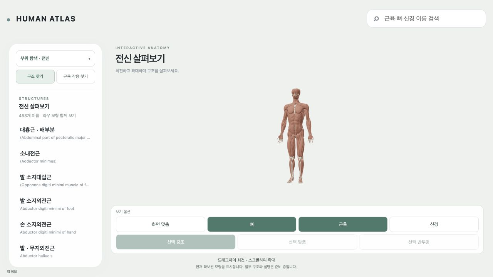
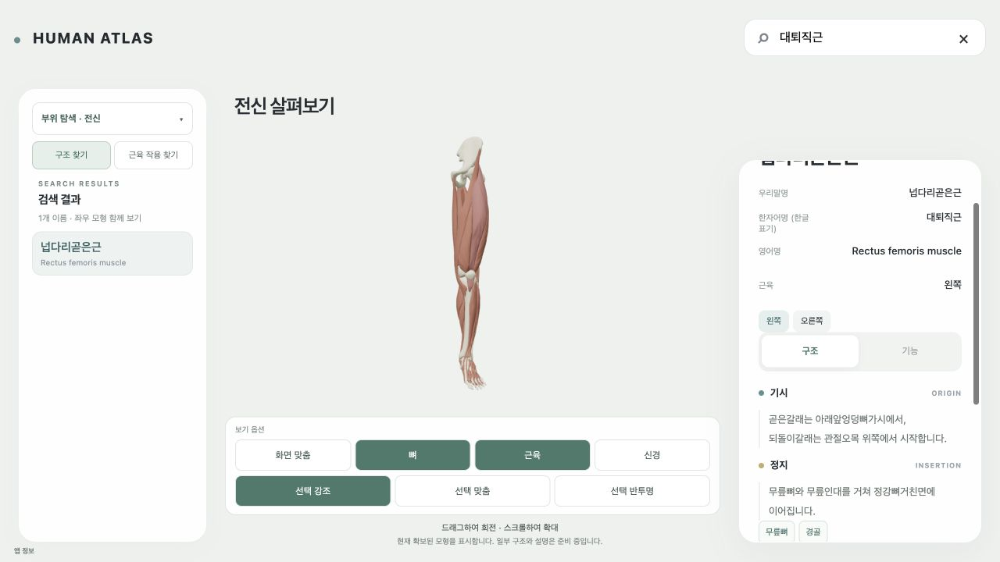

# HUMAN ATLAS / Visible Body UI·그래픽 비교

2026-10-07. 현재 작업 트리의 실제 앱과 Visible Body 공식 공개 화면·설명을 대조했다. 이 후속 변경은 새 번호 task가 아니며 기존 task 상태·범위 판정을 바꾸지 않는다.

## 판단

현재 앱에는 한글 이름 검색, 12부위 복수 탐색, 구조/기능 카드, 숨김·반투명, 근육 작용과 관절 조절, 신경 설명의 기본 경로가 있다. 우선 개선할 것은 버튼 추가보다 **모형이 차지하는 화면 비율, 관찰 시점, 깊은 구조 접근, 근육/힘줄 재질 구분**이다. Visible Body와 같은 범위의 전체 콘텐츠나 그래픽 품질이 완성됐다고 판정하지 않는다.

실제 관측한 홈은 1280×720이며 canvas는 976×317.5였다. 세로 공간이 좁아 전신이 작게 보인다. 근육은 비교적 균일한 갈색 재질이고 뼈는 밝은 색이다. 상세 카드에서는 대퇴직근의 기시정지 문장과 관련 뼈 링크를 확인했으나 정확한 부착 영역을 칠하는 표현은 없다. 구조/기능 전환 후 카드 내부의 스크롤 위치가 남아 제목 일부가 위로 잘리는 표본도 있었다. 이 현상은 이번 카메라 변경의 수정 대상으로 포함하지 않았으며 다음 카드 UX 검토 항목이다.

## 비교 범위와 출처

유료 Human Anatomy Atlas를 설치·실행하지 않았다. 아래 공식 화면과 튜토리얼을 사용했으므로 최신 유료 앱의 모든 버튼·애니메이션·성능을 검증한 비교는 아니다. 공식 공개 `tendon-options` GIF를 실제로 열어 손·전완의 뼈, 힘줄 및 부착 부위 표시를 관찰했다. 참고 이미지·모델을 우리 앱 자산으로 복제하지 않았다.

- [Human Anatomy Atlas 2027 공식 앱 목록](https://apps.apple.com/us/app/human-anatomy-atlas-2027/id1117998129): 현재 제품 설명과 학습 범위 확인.
- [Atlas 2023 공식 기능 소개](https://www.visiblebody.com/blog/new-human-anatomy-atlas-2023): 근육 상세의 부착·신경 연결 및 공개 GIF의 표현 확인.
- [Atlas 공식 사용 튜토리얼](https://www.visiblebody.com/blog/6-tips-to-help-you-become-a-human-anatomy-atlas-super-user): 부위/계통 탐색, Hide/Fade/Dissect, 주변 구조 추가와 분리 관찰 흐름. 2020년 자료이므로 최신 화면의 정확한 버튼 위치로 간주하지 않았다.
- [Muscles & Kinesiology 공식 소개](https://www.visiblebody.com/blog/meet-the-muscles-kinesiology-app): 작용 구간의 주동근 색과 복원 구간의 흐린 표현 참고. **별도 제품**의 예이며 Atlas의 현재 구현으로 합쳐 주장하지 않았다.

## 구현 우선순위

| 순서 | 비교에서 드러난 부분 | 현재 앱 | 권고 구현과 확인 기준 |
|---|---|---|---|
| 1 | 관찰 중심의 큰 모형 | 홈의 세로 canvas가 좁음. 선택/시범은 자동 프레이밍과 수동 회전 지원 | 화면 높이와 상세 패널 비율을 먼저 조정. 전신의 머리·발을 자르지 않으면서 크게 표시. 390/1024/1440, 패널 열림/닫힘, 키보드 초점에서 확인 |
| 2 | 숨김·Fade·분리로 깊은 구조 접근 | 기존 숨김·선택 반투명과 layer가 있음 | 선택 부근의 문맥을 유지하는 집중 관찰과 앞/뒤/좌/우 시점 추가. 사용자가 숨긴 표면을 다음 선택 때문에 다시 보이게 하지 않음. 복원 시 이전 상태 유지. 상시 버튼을 늘리기보다 문맥에 맞게 노출 |
| 3 | 근육·힘줄·뼈의 재질과 깊이 | 균일한 근육 색, 밝은 뼈, 선택 강조 | 검증된 조직 구분만 재질로 표현. 조명·roughness·normal을 공유 경로에서 다듬고 작은 화면의 신경 대비 보존. AO/대형 texture 도입 전 CPU render·draws·전송량 측정. 그림자만으로 구조 경계를 가리지 않음 |
| 4 | 기시정지의 뼈 위 부착 영역 표시 | 문장·관련 뼈 링크가 기본 | 실제 원본 좌표/영역 근거가 있는 경우에만 부착 mask와 bone paint 제작. 문장만으로 정밀 footprint를 생성하지 않음. 미확보 항목은 기존 문장/뼈 문맥 유지 |
| 5 | 신경 상세와 근육 문맥 연결 | 노란 정적 신경, 주행/포착·지배 관계와 관련 근육 연결 | 선택 신경의 전체 지원 주행·분지를 잘 보이게 하고 관계가 확인된 근육만 일관되게 강조. 텍스트·정적3D·지배 관계·동적 pose 지원을 구분. 힘/활성도 수치로 표현하지 않음 |
| 6 | 작용에 필요한 주변 구조와 단계별 강조 | 같은 scene의 준비/작용/복원, 7우선 근육군의 실제 작용, 주변 뼈/근육 문맥 | 이미 있는 player와 phase 표현을 재사용. 주동근/공동 이동/수동 주변 구조를 관계에 맞게 구분. 근육만 떠 있는 시범·잘못된 방향·작은 동작을 사례별 수리하고 검증된 작용을 하나씩 확대 |
| 7 | 저장·학습 장면 재사용 | 검색·URL·뒤앞 흐름 중심 | 필요할 때 로컬 북마크/관찰 시점 저장·이미지 내보내기 추가. 로그인 UI를 선행 조건으로 두지 않음 |

이 순서는 우선순위 제안이며 1–7 기능을 이번에 모두 구현했다는 뜻이 아니다. 밝은 배경, 한글 학습 카드, 단일 `움직임으로 이해하기` 버튼을 유지한다. 제거한 느리게/별도 멈춤/처음 자세 버튼이나 많은 보기 버튼을 복구하지 않는다. 추가 조직·전체 작용의 자료 확보를 현재 앱의 UI 개선 gate로 만들지 않는다.

## 이번 실제 구현: 첫 모형 등장

- 로딩 후 기존 카메라를 1.4초 동안 12° 이동시켜 몸이 살짝 왼쪽으로 돌아 보이도록 했다. quintic easing으로 출발·정지를 부드럽게 하며 opacity 0.2→1을 함께 적용했다.
- 단일 scene/renderer/frame clock을 재사용한다. 원본 mesh, source frame, 부착 좌표, GLB 또는 동작 범위를 회전시키지 않는다.
- 방향키·pointer·카메라 controls·보기/선택 변경·실제 pose 재생은 등장 회전을 취소한다. 홈 복원/지역 탐색마다 자동 재생하지 않는다.
- reduced-motion 설정에서는 등장 회전을 생략한다. 브라우저의 설정은 실제로 false였으므로 reduce=true 실기기 시험으로 주장하지 않는다.
- 회전 완료 후 dirty가 없으면 기존 idle 렌더 정책을 유지한다. 새 RAF나 viewer를 만들지 않았다.

## 실제 검증 / 한계

26개 관련 테스트, TypeScript 검사, production/local delivery build, execution projection check가 통과했다. 실제 브라우저에서 진행 중 opacity 0.202604→0.203974를 관측하고 방향키로 취소해 opacity=1과 자동 회전 종료를 확인했다. 최종 카메라/target의 yaw 차이는 12°였다. 대퇴직근 선택→기능→무릎 폄 반복→재클릭 복원 흐름을 확인했고 canvas 1개 및 root 유지, 콘솔 오류 0을 확인했다. 관련 기능의 전수 시각 합격이나 새 3폭 검증이라고 주장하지 않는다. 이번 변경은 CSS/레이아웃을 바꾸지 않아 기존 3폭 근거는 입력 영향 분석상 재사용할 수 있으나 실제 등장 관측은 1280×720이다.

빌드의 큰 JS chunk 안내는 남았다. 카메라 효과는 유료 Atlas 대비 GPU 성능·재질 품질이 동등하다는 근거가 아니다.

기존 로컬 주소 `http://127.0.0.1:5184/`의 전달 스냅샷을 갱신했다. 이는 보존된 작업 트리 기준이며 기존 WIP 의존 19개를 포함한다. 이번 커밋에 다른 작성자의 WIP를 포함하지 않는다. 외부 배포/링크 공개는 수행하지 않았다. 원본·OpenSim_Models·T13 및 기존 데이터 분모·권리 held·사람 검토 미수행 상태를 보존했다.

검증 수치·스냅샷·파일 해시는 [validation.json](validation.json)에 있다.

